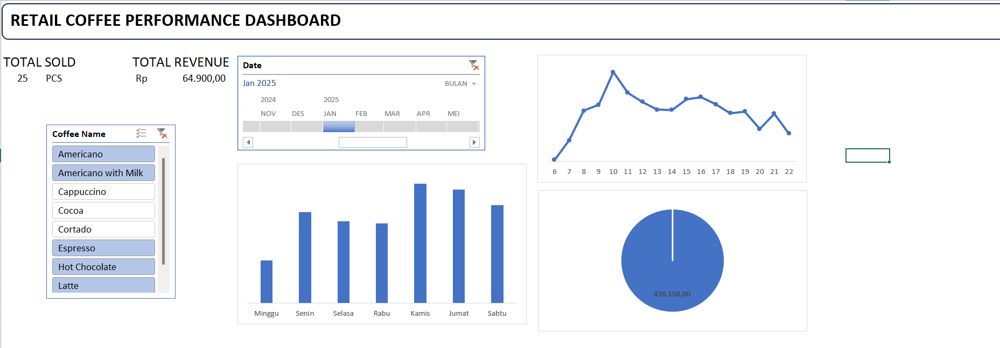

# ☕ Coffee Shop Sales & Operations Dashboard

An end-to-end interactive Excel dashboard designed to analyze coffee shop transactional data, identify revenue patterns, pinpoint peak operating hours, and understand customer payment behavior to optimize business operations.

---

## 📸 Dashboard Preview

---

## 📌 Business Problem & Case Study
The coffee shop management wants to understand daily revenue trends, identify top-performing products, and map out peak operational hours to optimize inventory allocation and barista shift scheduling.

---

## 🛠️ Tools & Skills Used
* **Tool:** Microsoft Excel
* **Data Cleansing & Extraction:** `HOUR()`, `TEXT()`
* **Data Aggregation & Lookup:** Pivot Tables, `SUMIFS`, `COUNTIFS`
* **Data Visualization:** Clustered Bar Charts, Line Charts, Donut Charts, Interactive Slicers, Custom KPI Cards

---

## 📊 Key Insights
* **Total Performance:** Generated **Rp 10,385,479** in revenue across **3,636 transactions**.
* **Top Products:** *Latte* and *Americano with Milk* were the highest revenue generators and most ordered items.
* **Peak Hours:** Transaction volume surged significantly around **10:00 AM** (349 orders), indicating a major morning rush.
* **Payment Preference:** **97.55%** of transactions were made via **Card/Digital Payment**, with Cash accounting for only **2.45%**.

---

## 💡 Actionable Business Recommendations
1. **Barista Shift Allocation:** Increase staffing during peak morning hours (08:00 AM – 11:00 AM) to maintain fast order fulfillment.
2. **Inventory Optimization:** Maintain higher buffer stock for high-demand ingredients (*fresh milk* and *espresso beans*).
3. **Cashless Infrastructure:** Maintain backup EDC terminals and stable internet connection due to the overwhelming dependence on card payments (97.5%+).

---

## 📁 Repository Structure
* `Coffee_Shop_Sales_Dashboard.xlsx` : Full interactive Excel workbook.
* `dashboard_preview.png` : High-resolution image of the dashboard layout.
